# Terraform CI/CD 

## Description:  

Create a CI/CD Pipeline and write a module to provision a VM instance and link the repo to the pipeline. 
<br> </br>
## Terrafom modules:


- The file **“main.tf”** for provisioning a VM has been created in the module folder. 
```

resource "google_compute_instance" "default" {
  name = var.vm_name
  machine_type = var.machine_type
  zone = var.zone

  boot_disk {
    initialize_params {
      image = var.image
    }
  }

  network_interface {
    network = var.network_name

    access_config {
      // Ephemeral public IP
    }
  }

  metadata_startup_script = "echo hi > /test.txt"
}
```

- **“backend.tf”** file for storing state file in GCS bucket. 

```terraform {
  required_providers {
    google = {
      source = "hashicorp/google"
      version = "4.27.0"
    }
  }
  backend "gcs" {
    bucket = "$(bucket_name)"
    prefix = "$(backend_value)-statefile"
    credentials = "serviceaccount.json"

  }
}
```

- **“provider.tf”** consists of project and credentials details. 

```
provider "google" {
  version = "4.27.0"
  project = var.project_name
  credentials = file("serviceaccount.json")
}
```

- Variable data types were declared in **“variables.tf”** file and the values were declared in **“values.tfvars”** file.  

```
machine_type = "$(machine_type)"
vm_name = "$(vm_name)"
zone = "$(zone)"
boot_image = "$(boot_image)"
network_name = "$(network_name)"
project_name = "$(project_name)"
```

- **"main.tf"** consist of module that calls the compute instance resource block in module folder.
```
module "gce" {
  source = "./module"
  machine_type = var.machine_type
  vm_name = var.vm_name
  zone = var.zone
  image = var.boot_image
  network_name = var.network_name
}
```
<br> </br>

## Git:
- Git was initialized in the directory and remote origin of Azure Devops repo has been added to the master branch.  
  

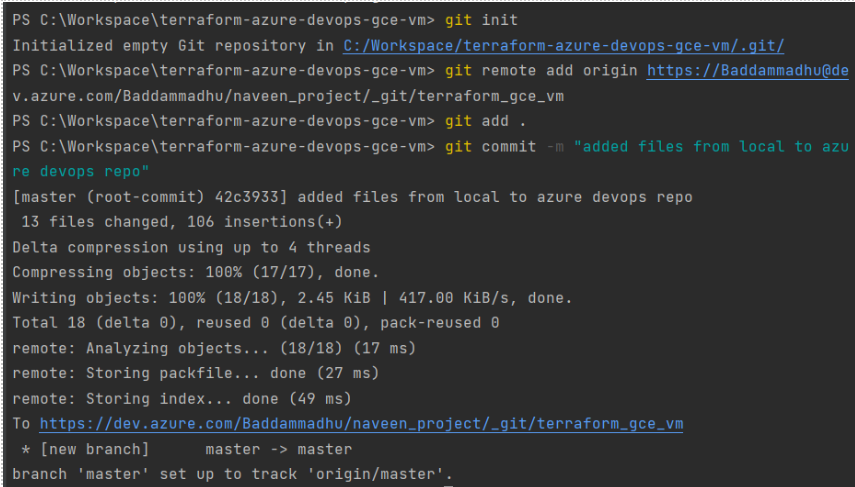  
<br> </br>
## Git repo in azure devops:
- The files were pushed into the repo in the master branch.  

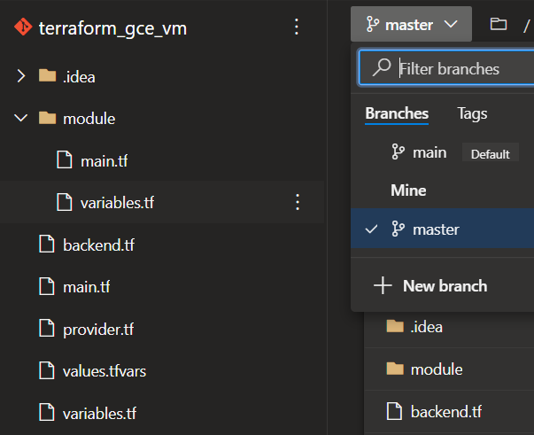  
<br> </br>
## Variable groups & secure files: 
- Variables required for terraform values were declared in the variable groups. 

- Multiple variables groups were created for build and each release stage. 

- The “serviceaccount.json” file was uploaded in the secure files. Sensitive files were uploaded in the secure files section for security.  

Variables groups:

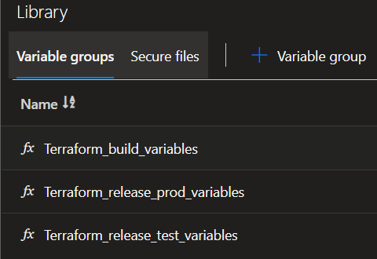  
<br> </br>
Variables in variable groups: 

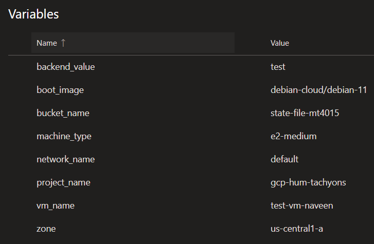  

<br> </br>
## Build Pipeline:  

- Variable group was linked to the build pipeline in Variables tab. 

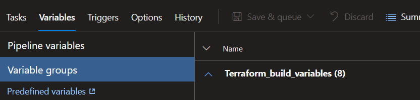  
- Build pipeline was created with the following 7 tasks:

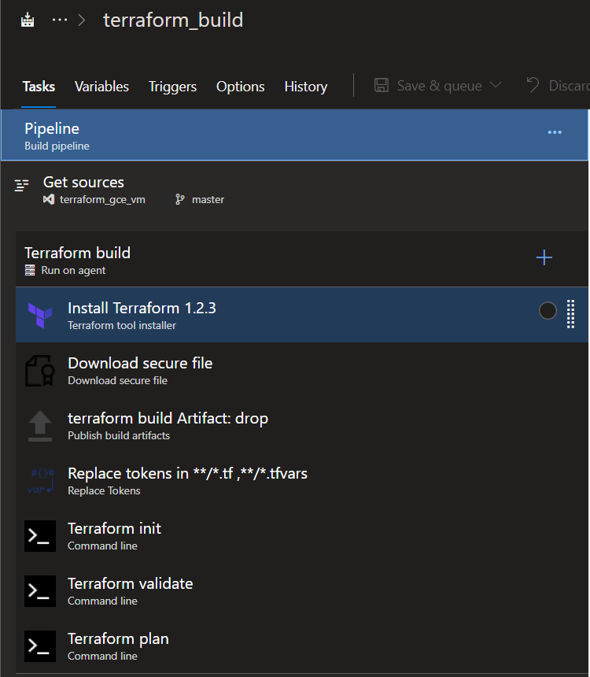  


1.  Installed terraform with the required version with terraform tool installer. 

2.  The service account Json file was downloaded from the secure file's location.  

>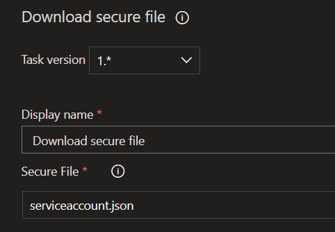  

3.  An artifact was built and published to the path of the project files.  

>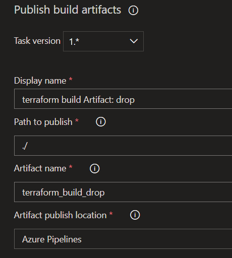  

4.  The backend variable and values were replaced with build variables which was declared in variables section. Changed target files to **".tf”** and **“.tfvars”**.   


> Variables in backend and values.tfvars to be replaced with variables in variable group:  
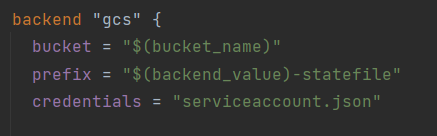  
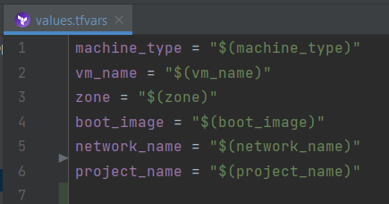  


5. The downloaded secure file was added to the current working directory and terraform was initialized.  

>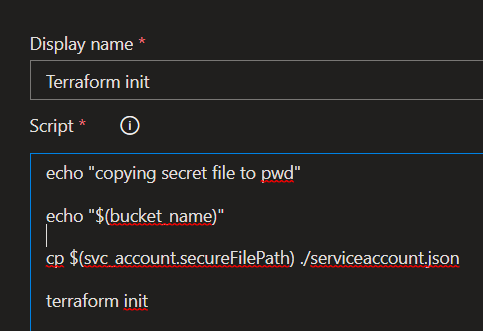 

6. Terraform validate.

>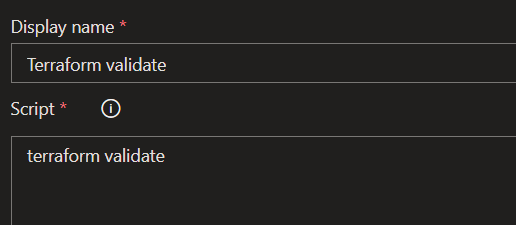   

7. Terraform plan.

>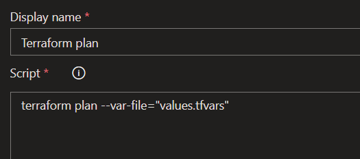  

<br> </br>

## Build pipeline execution:
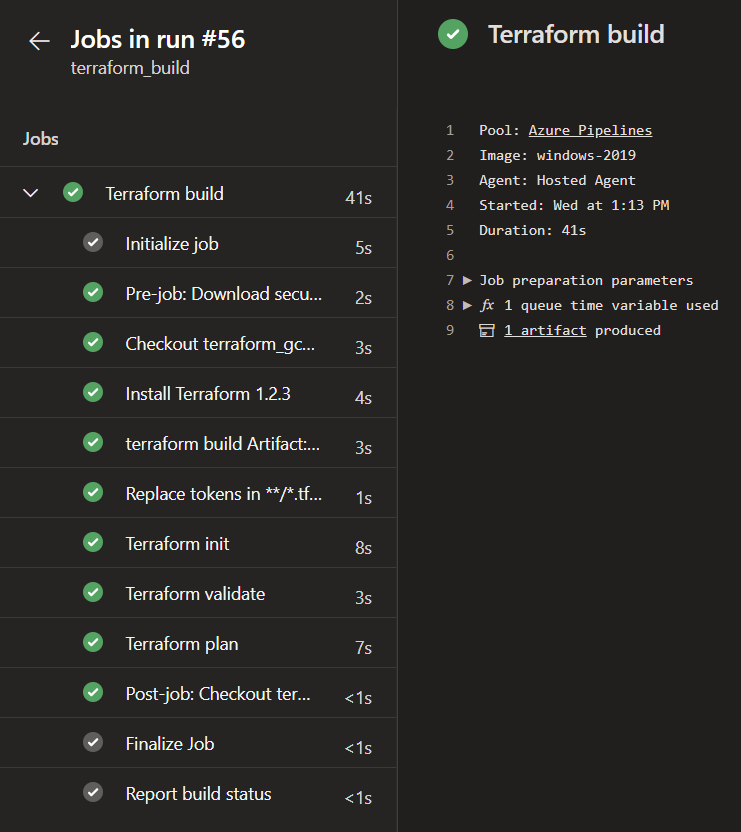  


---
<br> </br>

## Release pipeline:
- A release pipeline was created with the following stages.

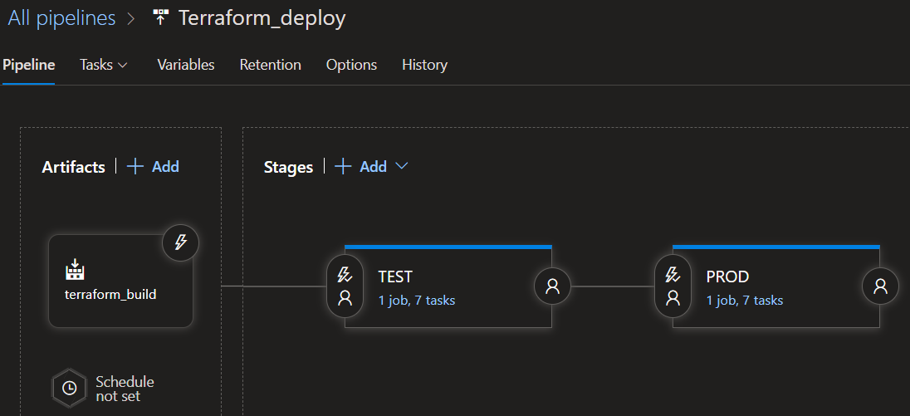  
- The built artifact from the “terraform_build” pipeline was the selected in the artifacts section. 

  

- The variable groups were attached to respective stage scops in the pipeline variable groups. 

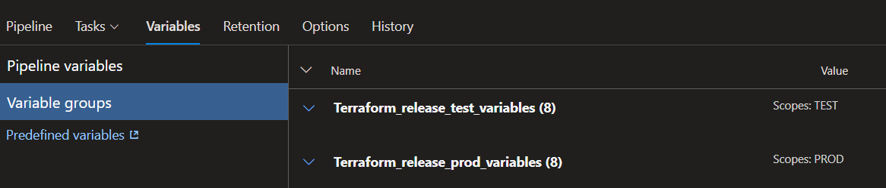  
- The TEST stage consists of 7 tasks as follows:

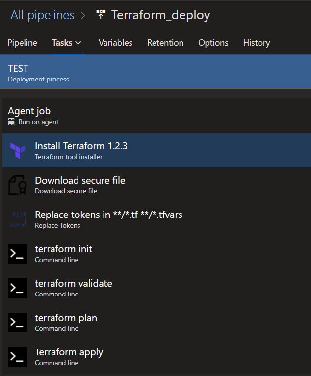  

1. Terraform was installed with the required version with terraform tool installer. 


2. The secure file was downloaded and copied to the current working directory. 

>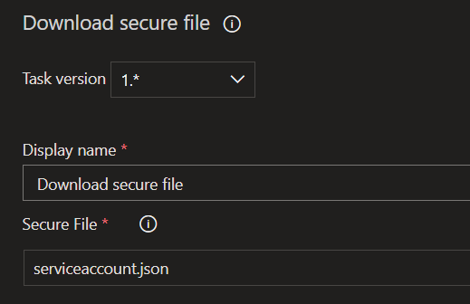  
3. The backend variable was replaced with build variable which was declared in variable groups. Changed target files to “.tf” and “.tfvars”.  
>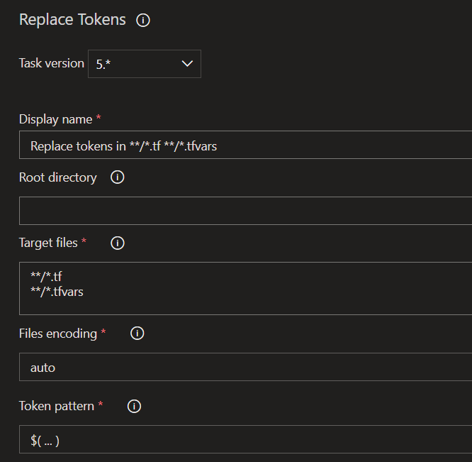  

4. The downloaded secure file was added to the current working directory and terraform was initialized. 

>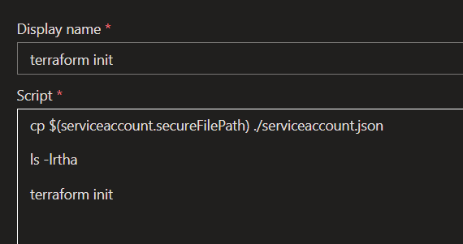  

5. Terraform validate.

>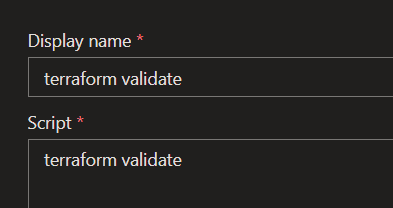  
6. Terraform plan.

>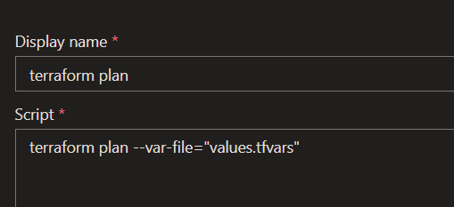  
7. Terraform apply.

>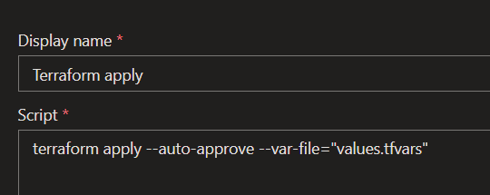  
- The PROD stage also consists of the same tasks as TEST with different variable linked.

<br> </br>

## Release pipeline execution:
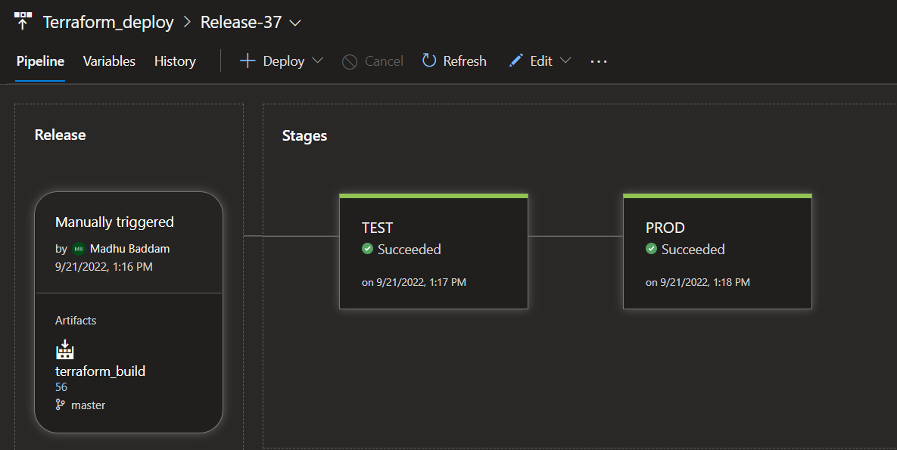  

<br> </br>

## Results:
- Two VM’s were created in GCP from the two stages in release pipeline. 

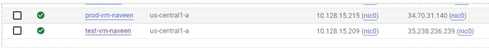  

<br> </br>

## Backend GCS bucket:
- The backend state files were created in a bucket with respective prefixes. 

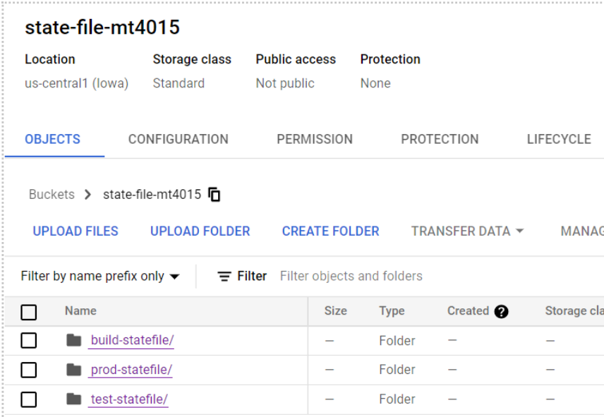  
---
<br> </br>
## Automation:
- Triggers can be set to trigger build and release pipelines.  

- Continuous integration triggers the pipeline whenever a new commit is made. 

- Scheduled trigger to schedule the trigger. 

- Build completion mode to trigger whenever a new version of dependent artifact is available. 

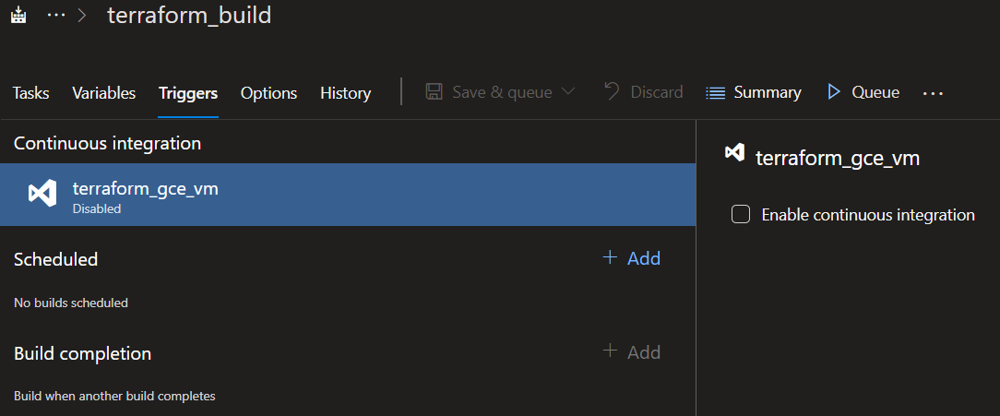  

- Two types of triggers in release pipeline.

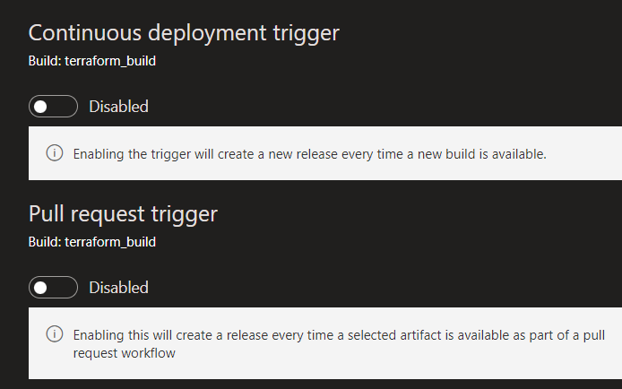  

